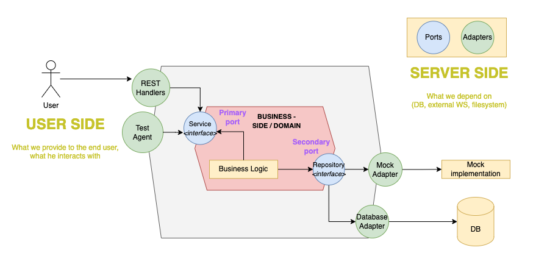

# Go Banking API

A simple banking API built with Go, using the Gin framework and PostgreSQL database, following the hexagonal architecture.



## Features

- Get all customers
- Get customer by ID
- Hexagonal architecture (Handler -> Service -> Repository layers)
- Support for both database and mock repositories
- Configuration management using Viper

## Prerequisites

- Go 1.23.2 or higher
- PostgreSQL database
- Git (optional)

## Dependencies

- [Gin](https://github.com/gin-gonic/gin) - Web framework
- [SQLx](https://github.com/jmoiron/sqlx) - Extensions to database/sql
- [Viper](https://github.com/spf13/viper) - Configuration management
- [lib/pq](https://github.com/lib/pq) - PostgreSQL driver

## Installation

1. Clone the repository:

   ```bash
   git clone https://github.com/pdusarux/go-bank.git
   cd go-bank
   ```

2. Install dependencies:

   ```bash
   go mod tidy
   ```

3. Create a `config.yaml` file in the root directory with the following structure:

   ```yaml
   app:
     port: 8080
   db:
     driver: "postgres"
     user: "your_db_user"
     password: "your_db_password"
     host: "localhost"
     port: "5432"
     dbname: "your_db_name"
     sslmode: "disable"
   ```

4. Run the application with a custom port:

   ```bash
   APP_PORT=5001 go run .
   ```

5. Alternatively, run the application without specifying a port:
   ```bash
   go run main.go
   ```

## API Endpoints

- `GET /customers` - Retrieve all customers
- `GET /customers/:customer_id` - Retrieve a customer by ID

## Credit

This project was created by CodeBangkok. Special thanks to CodeBangkok for the guidance in building a hexagonal architecture.

- [CodeBangkok](https://www.youtube.com/@CodeBangkok)
- [Hexagonal Architecture](https://www.youtube.com/watch?v=k3JZI-sQs2k&list=PLyZTXfAT27ib7T9Eg3qhvDE5rgvjQk4OL&index=11)
